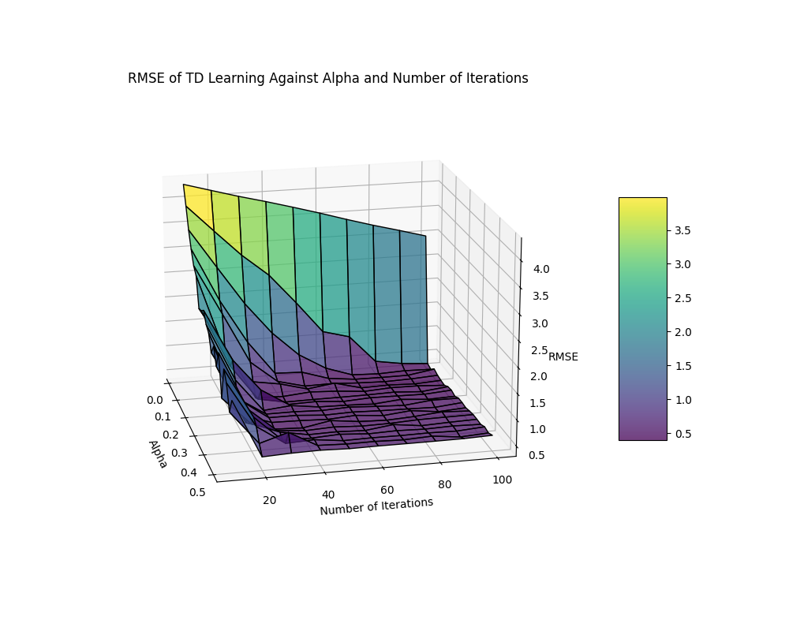
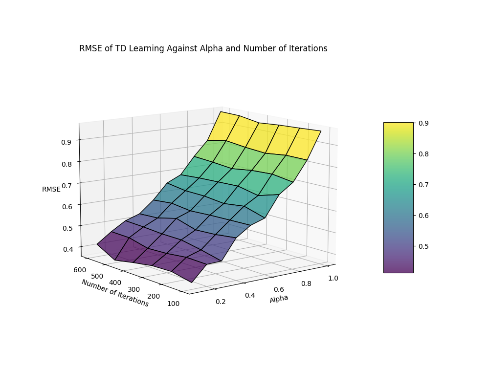

# Exploring Parameter Effect

We start by exploring how various $\alpha$ and `iteration_values` pairs work using an initial, broad grid search. With parameters $\alpha = [0.01, \dots, 0.5]$, `iteration_values` $= [10, \dots, 100]$, the z-axis measures the (R)MSE of the ground truth and the TD Learning value function.

In Figure 1, spanning $\alpha$ values from 0.01 to 0.5 and `iteration_values` from 10 to 100, the 3D meshgrid plot revealed a disproportionately high MSE at an alpha of 0.01 with just 10 iterations. This error arises from the algorithm's inability to adequately approximate the value function due to the excessively small $\alpha$ (i.e., minor updates to the value function) being unable to converge with limited iterations. In other words, this highlights the impracticality of minuscule $\alpha$ values for achieving convergence within fewer iterations.

Moreover, the plot's extreme values at low $\alpha$ and iteration counts significantly skewed the visual scale, masking the subtle variations in MSE for other $\alpha$-iteration combinations. There are multiple options to improve the visual scale of the plot, so we decided to use these two:

1. Change MSE to Root Mean Squared Error (RMSE) to decrease the magnitude of large values and increase the magnitude of small values. This will decrease the magnitude for $\text{MSE} > 1$ and increase the magnitude for $\text{MSE} < 1$, resulting in less skewing in the visual scale.
2. Narrow down the search space for more detailed and granular comparisons, providing sharper insights into the effect of $\alpha$ values and iterations. We will use $\alpha = [0.1, \dots, 1]$ and `iteration_values` $= [100, \dots, 600]$ to explore the trend of large and increasing $\alpha$ values.

The change to RMSE in Figure 2 improved the plot. Since the RMSE is the square root of the MSE, it brings the error values into a narrower range that is often more interpretable. Additionally, because the RMSE is on the same scale as the original data, it tends to be more representative of the true magnitude of the error. However, we still cannot discern the difference within larger $\alpha$-iteration pairs-the purple surface looks the same. Therefore, narrowing down the search space is the next step to take for better insights, which will be done for the next two figures.

Upon examining Figure 3, pronounced variance in the RMSE was observed across different $\alpha$ values and iteration numbers. This 'noise' is attributable to sampling variance, inherent stochasticity in exploration policies, and the bootstrapping nature of TD learning. This "noise" could potentially obscure the underlying patterns we sought to discern, making it challenging to draw definitive conclusions about the impact of different parameters on the convergence of the value function.

To address the variance in TD learning, we averaged the RMSE across numerous runs, smoothing out fluctuations and minimising outliers. This provided a clearer trend, allowing for a more precise evaluation of the learning rate's effect on convergence.

Figure 4 showcases the outcomes of this refined approach. The plot presents a less noisy visualisation of RMSE across different $\alpha$ values and iteration counts, averaged over 50 TD learning cycles. The results confirm a more discernible trend, illustrating the trade-offs between various $\alpha$ levels and the number of iterations required to achieve convergence.

This refined visualisation revealed that once a sufficient number of iterations are reached for a given $\alpha$, further iterations do not significantly alter the RMSE, signalling a form of convergence stability. However, this stability does not inherently guarantee optimality, as the model could settle with a suboptimal solution. Moreover, setting a fixed number of iterations according to $\alpha$ is not universally applicable because larger, more complex environments and factors like the discount factor could affect the quality and accuracy of the convergence, leading to the need of re-optimising the hyperparameters $\alpha$ and number of iterations.

# Iteration-by-Iteration Exploration and Decaying $\alpha$

This section explores the influence of various constant $\alpha$ values on the convergence behavior of a TD learning algorithm and introduces the decaying $\alpha$.

The visual comparison in the above figures paints a clear picture: lower $\alpha$ values correspond with slower convergence rates as evidenced by a gradual decline in log-scaled RMSE. Notably, the smallest $\alpha$ (0.0001) fails to converge within 500 iterations, suggesting inefficiency for practical purposes. In stark contrast, a higher $\alpha$ (0.5) quickly reaches a plateau, yet its RMSE levels off at a higher value compared to lower $\alpha$ values, indicating potential oscillation around the optimal value and not necessarily converging to the true minimum.

This phenomenon highlights the delicate balance needed when choosing $\alpha$ in TD learning. While higher $\alpha$ values can accelerate the learning process, they risk missing the precise solution. Lower $\alpha$ values, although more stable and potentially more accurate, require patience and computational resources due to their slower convergence rate.

So arises the question: must we choose between fast or accurate convergence, or can we have both? The introduction of a decaying $\alpha$ suggests a promising middle ground.

The decaying $\alpha$ is calculated as:
$$
\alpha_{\text{current}} = \alpha_{\text{initial}} \cdot e^{-\lambda t}
$$
where $\alpha_{\text{initial}}$ starts at 0.05, $\lambda$ is the decay rate at 0.1, and $t$ denotes iteration count.

The addition of a decaying $\alpha$ showcases the best of both worlds: rapid early convergence akin to high $\alpha$ values and, as the learning rate reduces, a refined approach towards the true minima similar to what is observed with low $\alpha$ values.

The table below represents for each $\alpha$ setup, the final RMSE and at which iteration it stabilises, these are the results after 500 iterations:

| Alpha Setup                                            | Final RMSE | RMSE Stabilising Iteration |
|--------------------------------------------------------|------------|----------------------------|
| Constant Alpha = 0.0001                                | 0.2021     | Did Not Stabilise          |
| Constant Alpha = 0.0005                                | 0.06401    | $\approx$ 200              |
| Constant Alpha = 0.05                                  | 0.3515     | $\approx$ 10               |
| Constant Alpha = 0.5                                   | 0.7966     | $\approx$ 10               |
| Decaying Alpha ($\alpha_{initial}$ = 0.1, $\lambda$ = 0.05) | **0.03834** | $\approx$ 140  |

As evidenced, the decaying $\alpha$ not only accelerates convergence but also refines its trajectory towards the optimal solution more precisely than constant $\alpha$ values. This dynamic adaptation shows the potential of adaptive learning rates to enhance the efficacy of TD learning across various settings.

In conclusion, the selection of $\alpha$ in TD learning is a nuanced task that demands contextual consideration. Nonetheless, this study illuminates the promising application of a decaying $\alpha$, substantiating its role in achieving both rapid and precise convergence—a combination that static learning rates struggle to provide.

A fun, optional side project is testing negative $\alpha$ values, here are the results:

![TD Learning Time-Series Comparison of $\alpha = [-0.001, 0.005]$](images/q1_f_negative_alpha.png)

As expected, the figure shows the RMSE increasing exponentially (log-scale) and indefinitely as the algorithm is doing the opposite of what it is supposed to do.

# Investigating Convergence

This initial subsection investigates the convergence characteristics of Q-learning across a span of iterations, aiming to gain insights into the algorithm's learning trajectory. To explain Q-learning's progression towards convergence, we will examine two pivotal metrics: the delta of the value function and the cumulative sum of rewards. These metrics serve as indicators of two fundamental aspects of learning: how the estimated value of states stabilizes over time, and how the policy's effectiveness in accumulated rewards evolves.

The delta metric is derived from the sum of the absolute differences between the current $V_t$ and previous values $V_{t-1}$ in the value functions in each state $s$ (i.e., in each cell of the 2D value function array):

$$
\delta = \sum_{s \in S} |V_{t}(s) - V_{t-1}(s)|
$$

It should be understood like this whenever we refer to *delta* as a metric in questions 2c and 2f. The rewards metric is calculated by modifying `td_controller.py`, specifically `find_policy` to return a list of rewards for each episode in an iteration, then summed up to a reward per iteration metrics.

Our methodology to explore these metrics involves an analysis of graphical plots. To reduce variability and provide a more stable overview, the values plotted on the y-axis represent averages taken across multiple simulation runs. Additionally, to further reduce noise and enhance the clarity of trends, we apply a smoothing technique: data from every 20 iterations are aggregated to produce a single data point, streamlining the plots and focusing attention on the overarching learning patterns rather than noisy fluctuations. This smoothing refines the nature of the learning process, offering an interpretable view of the algorithm's behavior over time.

Log-scaling is applied to the delta of the value functions to diminish the impact of extreme values and to provide a clearer visualization of the rate of convergence as learning progresses.

Figures above present a combined outlook of the learning process captured by the Q-learning algorithm over 10,000 iterations. Initially, as seen in the first figure, there is a sharp decrease in the log delta of the value function, signaling substantial adjustments in the agent’s understanding of the environment. Concurrently, the second figure depicts a rapid ascent in the sum of rewards, reinforcing the idea that the agent is quickly capitalizing on the environment to accumulate gains.

Following this initial burst of learning, both figures illustrate a stabilization phase: the delta change and the sum of rewards level off into minor oscillations. This plateau signifies the transition from a phase of discovery and learning to careful optimization, where gains from newfound knowledge are less dramatic, possibly because the agent has already exploited the more obvious strategies for higher rewards.

Overlaying the $\epsilon$ value on these plots emphasizes the exploration-exploitation balance in play. The declining purple line denoting $\epsilon$ indicates a decreasing tendency for exploration over time. As the algorithm progressively favors exploitation of the known strategy, the rate of discovery and learning plateaus. The alignment of reduced $\epsilon$ values with the flattening of delta change and reward accumulation suggests that as exploration decreases, so does the likelihood of large gains, which corresponds with a matured policy that requires less deviation from established strategies.

An interesting observation in the zoomed figure is after the steep decline, it exhibits a slight rebound (highlighted in the dark blue circle), indicative of the algorithm correcting an overshoot in value estimation. This could be reflected by Q-learning's off-policy nature, which allows it to make larger, riskier updates in search of an optimal policy.

To complement the graphs, we will refer to tabulated data that provide a statistical summary, including the mean and variance of both the value function delta and the sum of rewards at specified iteration checkpoints (Note that 50,000 and 100,000 in the table are added for the next subsection).

| Num Iterations | Mean Delta | Var Delta | Mean Rewards | Var Rewards |
|----------------|------------|-----------|--------------|-------------|
| 100            | 1.581      | 116.6     | 2301         | 4.6122e+06  |
| 500            | 0.3801     | 23.67     | 2705         | 9.6373e+05  |
| 1,000          | 0.2323     | 11.86     | 2766         | 4.8578e+05  |
| 5,000          | 0.1165     | 2.375     | 2826         | 9.8372e+04  |
| 10,000         | 0.1024     | 1.188     | 2836         | 4.9534e+04  |
| 50,000         | 0.09169    | 0.2376    | 2846         | 1.0525e+04  |
| 100,000        | 0.09037    | 0.1188    | 2847         | 5.829e+03   |

The table showcases the relationship between the number of iterations and the convergence behavior of the Q-learning algorithm, reflected through the mean and variance of the delta change in the value function and the sum of rewards.

As the number of iterations increases, the mean delta decreases, which could represent the algorithm stabilizing and making smaller adjustments to the value function. This suggests that the agent is approaching an optimal policy over time, as fewer significant changes to the value function are necessary. Conversely, the mean sum of rewards increases, which could suggest that the agent is accumulating more rewards as it learns better policies. These trends imply that as the agent refines its strategy, it becomes more proficient at navigating the environment to collect rewards.

Regarding variance, both delta and sum of rewards have a clear downward trend as the number of iterations rises. This decrease in variance could indicate that the agent's performance is becoming more consistent over time, reinforcing the idea of a steady and reliable learning progression and policy refinement.

To encapsulate the observations:

- The mean delta decreases as the number of iterations increases, reflecting the agent's learning and stabilization.
- The mean sum of rewards increases, indicating an improvement in the agent's ability to gain rewards through enhanced policies.
- The variance in both delta and sum of rewards decreases, denoting more consistent performance and reduced variability in the agent's learning and reward-gathering over time.

However, the statistical trends in the table must be interpreted in conjunction with the patterns observed in the convergence plots. Although the table suggests a progression towards stability and optimality, this is affected by the initial large changes in both the delta and rewards that might skew the overall mean and variance. To better understand the algorithm's performance beyond the initial learning surge, examining the statistics post the initial convergence phase — starting from iteration 50 onwards — is essential. This approach would minimize the impact of the early fluctuations and provide a more accurate representation of the algorithm's behavior as it slowly refines towards better policy. Considering this perspective, the mean and variance values from later iterations would likely show little variation, indicating that the Q-learning algorithm has settled into a stable policy with fewer significant explorations.

| Num Iterations | Mean Delta | Var Delta | Mean Rewards | Var Rewards |
|----------------|------------|-----------|--------------|-------------|
| 100            | 0.07124    | 8.644e-05 | 2,741        | 2,830       |
| 500            | 0.08080    | 1.572e-04 | 2,799        | 2,959       |
| 1,000          | 0.08349    | 1.743e-04 | 2,814        | 2,517       |
| 5,000          | 0.08702    | 1.778e-04 | 2,835        | 2,178       |
| 10,000         | 0.08784    | 1.809e-04 | 2,841        | 2,335       |
| 50,000         | 0.08864    | 1.854e-04 | 2,846        | 3,816       |
| 100,000        | 0.08871    | 1.863e-04 | 2,847        | 4,961       |

Table 2, offers a clearer picture of the algorithm's behavior in the steadier learning phase. The similar and low mean and variance values across iterations indicate a more consistent performance, with less variability in the agent's learning and reward collection. This suggests that the Q-learning algorithm tends towards a stable policy with minimal exploratory deviations after the initial adaptation period. This focused analysis underscores the importance of studying the algorithm's performance within sections of its the entire learning trajectory. By excluding the initial learning surge, we uncover steady improvement and stabilization that more accurately reflects the algorithm's effectiveness in refining its policy over time.

# Investigating Optimality

To dive deeper into the optimality of the Q-learning algorithm, we extend the analysis to 100,000 iterations with key checkpoints at [100, 500, 1,000, 5,000, 10,000, 50,000]. This allows for a prolonged examination of the algorithm's performance, providing insights into its long-term convergence patterns.

The extended run revealed that oscillations within the value function delta continue even at 100,000 iterations. These persistent fluctuations suggest that while the algorithm refines its value estimates, there remains an inherent level of uncertainty and exploration.

In addition, the performance metrics of 50,000 and 100,000 iterations show similar trends where the mean and variance do not change much. As the number of iterations increases, the value of $\epsilon$ decreases due to the term $\sqrt{1 + 0.25 \cdot i}$ in the denominator, which means the algorithm is less likely to take random exploratory actions and more likely to exploit the current knowledge it has of the policy.

This decreasing $\epsilon$ is likely contributing to the stable mean and low variance seen in the table. As exploration diminishes over time, the agent relies more on the learned values, leading to less variability and more predictable results. The steady values suggest that the algorithm is making fewer significant changes to its policy, reinforcing the concept of convergence to a stable policy.
